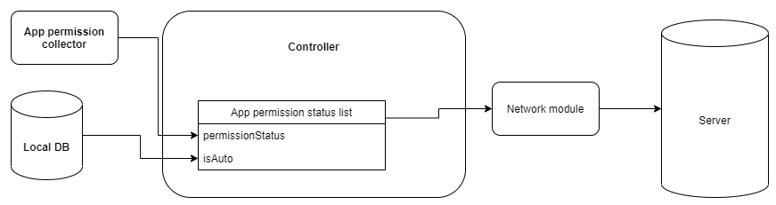
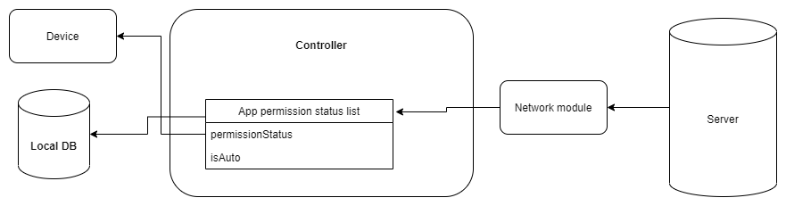
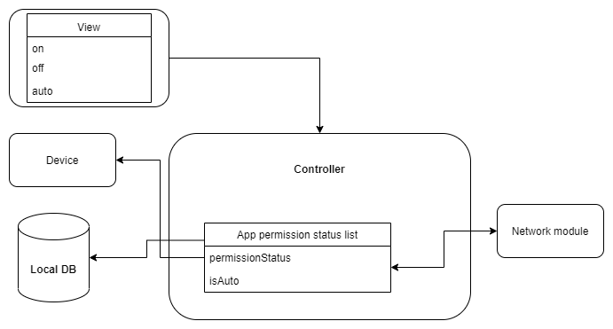

# 요약
안드로이드 환경에서 새로운 앱을 설치하여 사용할 때, 해당 앱이 요청하는 권한들에 대한 과도한 승인은 개인 정보 유출을 비롯한 보안 문제들로 이어질 수 있다. 
이에 대한 기존 연구는 앱들에게 이미 허용한 권한 내역을 수집하여 사용자에게 보여주는 수준인데, 앱이 과도한 권한을 요구하는가에 대한 판단은 사용자 개인에게 전적으로 의존하고 있다. 

본 논문에서는 이러한 한계를 개선하기 위해 안드로이드 앱의 요구 권한 내역 탐지와 더불어 사용자의 권한 별 허용 비율을 관리하는 시스템을 제안하고 주요 기능을 구현하였다. 
이 시스템은 통계적 결과를 바탕으로 불필요한 권한의 사용을 자동으로 방지해 주므로 모바일 프라이버시 강화에 기여할 것으로 기대된다.

## 핵심어(Key Words).
안드로이드 보안(Android security), 안드로이드(Android), 권한 관리(Permission management), 모바일 프라이버시(Mobile privacy), 모바일 보안(Mobile security)

# 서론
스마트폰이 많이 사용되는 만큼 모바일 앱에 관련된 보안 문제 또한 증가하고 있다. 대부분의 안드로이드 앱은 설치 또는 실행 시 사용자에게 팝업창을 띄워 권한 허용 여부를 물으며 앱의 기능을 수행하기 위해 필요한 권한을 요구한다. 또한, 해당 앱이 요구하는 대부분의 권한을 허용해야 앱의 원활한 기능 사용이 가능하다. 이러한 부분 때문에 대부분의 사용자들은 해당 권한이 앱에 필요한 권한인지 주의 깊게 확인하지 않고 허용하는 경우가 많다[1].

따라서 이를 악용한 과도한 권한을 요구하는 앱들이 배포될 수 있고 이는 개인 정보 유출을 비롯한 보안 문제들로 이어질 수 있다. 이에 대해 앱들이 요구한 권한 내역을 수집하여 관리하는 시스템에 관한 연구들이 진행해왔지만, 앱이 과도한 권한을 요구하는지에 대한 판단과 권한 허용에 대한 관리는 사용자 개인에게 전적으로 의존하고 있다[2]. 따라서 본 논문에서는 이러한 한계를 개선하기 위해 안드로이드 앱의 요구 권한 내역 탐지와 더불어 사용자의 권한 별 허용 비율을 관리하는 시스템을 제안하고자 한다. 이를 front end에서 android native, backend에서는 spring framework를 활용하여 구현했다.

# 본론

## 용어 정리

- App permission status list
```
[
  {
    "AppId": "",
    "permissionId": "",
    "permissionStatus": "", // on, off
    "isAuto": "", // true, false
  },
  ...
]
```
- Permission status
  - (manually) on
    - 사용자가 의사를 가지고 권한을 활성화한 경우
  - (manually) off
    - 사용자가 의사를 가지고 권한을 비활성화한 경우
  - (auto) on/off
    - 사전에 설정한 목표 권한금지비율에 따라 자동으로 설정된다.
    - 앱의 취지상 로컬 데이터베이스에 없던 앱의 권한이 허가로 되어있을 경우, 이는 auto on으로 본다.

- 권한금지비율 (Banned permission ratio)
전체 어플리케이션 이용자 중, 해당 앱을 사용자가 직접 금지한 비율을 뜻한다.
예를 들어 어플리케이션 A가 있고, 앱 A가 권한 b를 요구했을 때 전체 사용자중 20%는 b를 허가하고, 60%가 auto, 20%가 권한 거부를 했다면, b의 권한금지비율은 20%가 된다.

- 목표권한금지비율 (Target banned permission ratio)
목표가 되는 권한금지비율이다. 에를 들어, 목표권한금지비율이 50%이고 앱 A의 권한 b, c의 권한금지비율이 각각 20%, 60%라면 c는 비활성화 된다.

## 설계


### Frontend (Android client)
- Controller
  - 사용 중인 앱의 권한 수집 및 수정, 사용자에 의한 권한 변경에 대응하는 전체 로직을 제어한다.
- App permission collector
  - Android API를 활용하여 설치되어 있는 Application list와 permission list, permission on/off list를 모아온다.
- Network module
  - Get app-permission-status-list-on-tbpr
    Permission status가 auto인 permission들에 대해 사전에 설정한 목표권한금지비율에 따라 on/off 여부를 가져온다.
  - Post app-permission-status-list
    Controller에서 도출한 App permission status list를 백엔드서버에 업데이트한다.
- View
  - Target banned permission ratio setting
  - app list
    - app permission list
      - set permission status   
- Local DB (SQL Lite)
  - Record
    - appId      
    - permissionId
    - permissionStatus

### Backend (Spring Framework)
- Rest API controller
- Model
  - InstanceId [3]
  - appId
  - permissionId
  - permissionStatus
- DB


## 사용 중인 앱의 권한 수집 및 수정


- Frontend 에서 android API를 이용하여 디바이스에 설치된 모든 앱의 권한과 권한 허용 여부를 가져온다.
- Local DB(sql lite)에 있는 기존 app permission status list를 불러온다.

아래 로직을 통해서 현재 설정되어 있는 권한이 본 앱의 자동화된 관리로 업데이트 된 것인지, 사용자가 직접 지정한 것인지 판별한다.

|LDB\Collector|on|off|
|:-----:|---|---|
|aOn|aOn|mOff|
|aOff|mOn|aOff|
|mOn|mOn|mOff|
|mOff|mOn|mOff|
|null|aOn|mOff|

(LDB: local DB, aOn: auto on, aOff: auto off, mOn: manually on, mOff: manually off, null: not exist)

- 권한 변경사항을 네트워크 모듈을 통해 서버에 업데이트한다.
- auto 상태를 업데이트하기 위해서 Target banned permission ratio 따라 on/off 권한 리스트를 네트워크 모듈에 요구한다.
- 서버에서 가져온 app permission status list on tbpr에 따라 디바이스의 각 앱 권한들을 변경한다.
- 현재 상태를 Local DB에 저장한다.


## 사용자에 의한 권한 변경



DB(sql lite)에 있는 기존 app permission status list를 불러온다.

### Manually on/off -> auto의 경우
- 권한 변경사항을 네트워크 모듈을 통해 서버에 업데이트한다.
- auto 상태를 업데이트하기 위해서 Target banned permission ratio 따라 on/off 권한 리스트를 네트워크 모듈에 요구한다.
- 서버에서 가져온 app permission status list on tbpr에 따라 디바이스의 각 앱 권한들을 변경한다.
- 현재 상태를 Local DB에 저장한다.

### auto -> Manually on/off 의 경우
- 권한 변경사항을 네트워크 모듈을 통해 서버에 업데이트한다.
- 변경사항에 따라 앱 권한을 변경한다.
- 현재 상태를 Local DB에 저장한다.


# 결론
본 논문에서는 안드로이드 앱의 권한 허용 내역 탐지와 더불어 사용자의 권한별 허용 비율을 관리하는 시스템을 제안하고 프로토타입을 구현하였다. 이 시스템은 기존 연구와 달리 통계적 결과를 바탕으로 불필요한 권한의 사용을 자동으로 방지한다는 점에서 과도한 권한의 허용을 관리하는 새로운 모델을 제안했다는 점에서 의의가 있고 이에 따른 모바일 프라이버시 강화를 기대할 수 있다. 

하지만, 불필요한 권한을 판단하는 통계적 결과는 사람의 판단에 의한 것으로 해당 시스템의 이용자 수가 충분하지 않으면 통계의 신뢰도가 떨어진다는 한계가 있어 이를 개선할 필요가 있다.
따라서 향후 사람이 개입되지 않고 정확하게 '이것이 과도한 권한인가'에 대한 판단을 하는 알고리즘을 머신러닝을 통해서 구현하고 추가하면 더 좋은 연구가 될 수 있을 것 같다.

# 참고문헌
- [1] A.P. Felt et al, “Android permissions: user attention,comprehension, and behavior,” Proc. of SOUPS ’12, July 2012.
- [2] 배경륜, 이연재, 김의연, 태규빈, 김형종, 이해영. (2018). 과도한 권한을 요구하는 안드로이드 앱 탐지. 한국컴퓨터정보학회 동계학술대회 논문집, 26(1), 79-80.
- [3] https://firebase.google.com/support/privacy/manage-iids?hl=ko
- [4] Permission Explorer, https://github.com/ruippeixotog/permission-explorer
- [] CWE-250: Execution with Unnecessary Privileges
- [] 유홍렬, 권태경. (2014). 안드로이드 권한의 위험을 판단하기 위한 평가척도에 관한 연구. 한국정보과학회 학술발표논문집, (), 1009-1011.