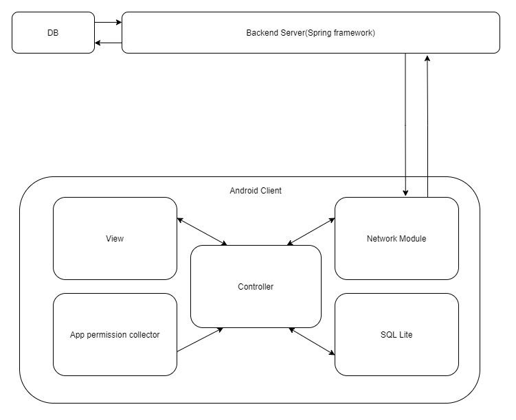

# Abstract.
안드로이드 환경에서 새로운 앱을 설치하여 사용할 때, 해당 앱이 요청하는 권한들에 대한 과도한 승인은 개인 정보 유출을 비롯한 보안 문제들로 이어질 수 있다. 
이에 대한 기존 연구는 앱들에게 이미 허용한 권한 내역을 수집하여 사용자에게 보여주는 수준인데, 앱이 과도한 권한을 요구하는가에 대한 판단은 사용자 개인에게 전적으로 의존하고 있다. 

본 논문에서는 이러한 한계를 개선하기 위해 안드로이드 앱의 요구 권한 내역 탐지와 더불어 사용자의 권한 별 허용 비율을 관리하는 시스템을 제안하고 주요 기능을 구현하였다. 
이 시스템은 통계적 결과를 바탕으로 불필요한 권한의 사용을 자동으로 방지해 주므로 모바일 프라이버시 강화에 기여할 것으로 기대된다.

# 핵심어(Key Words).
안드로이드 보안(Android security), 안드로이드(Android), 권한 관리(Permission management), 모바일 프라이버시(Mobile privacy), 모바일 보안(Mobile security)

 그래서 우리가 할 일은
 - 권한을 확인해서 리스트로 뽑아오는 기능
 - 앱 리스트를 서버로 보내서 밴된 기능 받아오기
    - 몇 % 이상 밴되었는가? // 사용자 커스텀 가능
 - 리포트 구현
    - 설치지 거절된 권한 수집
    - 사용자가 앱을 통하여 권한을 해제했을 경우 전송
 - 백앤드 서버 구현
    - 리포트 된 권한이 일정 비율을 넘어갈 경우 과도한 권한이라고 판단

# 설계

## Backend(spring framework)

### Report
- client Id
  - 단순 앱 고유 식별자
  - Report가 업데이트 된 경우, 중복을 배제하기 위해서.
- app list
- banned auth per apps

### Currently banned auth via app.
- query
  - parameters
    - appId
    - banned ratio

## Android client

### View
- banned ratio setting
- app list
- app auth list
- on/off auth
  - status
    - manually on
      - 사용자가 본 앱을 통해 활성화한 경우
    - manually off
      - 사용자가 앱을 설치할 때 거부한 경우
      - 사용자가 본 앱을 통해 비활성화 한 경우
    - auto
      - 설정한 banned ratio에 따라 자동 동기화 (default)

### App auth collector
- App auth collect
- DB(sql lite)에 있는 구 app auth status를 불러와서 비교
- auto 상태(manually on/off 되어있는 권한을 제외)에 해당하는 권한 리스트를 네트워크 모듈에 요구
- manually setting된 권한 변경사항을 네트워크 모듈에 업데이트
- 모든 동기화가 끝나고 현재 상태를 디비에 저장

### 네트워크 모듈
- collector 에서 모아온 앱들의 banned auth by ratio를 가져옴 
- collector에서 현재 상황을 리포트한 것을 백엔드서버에 업데이트

# 구현
## Todo

# Future work.
과도한 권한을 판단하는 기준이 지나치게 휴리스틱임.
이걸 멋있게 돌아가게 하는 알고리즘을 추가하면 더 좋은 프로젝트가 될 듯 (a.k.a ML)